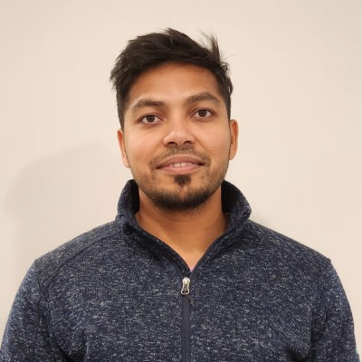
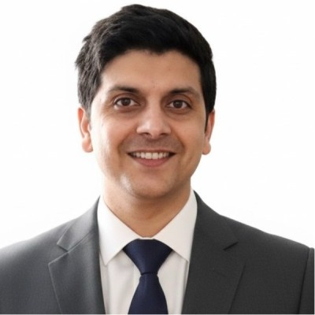
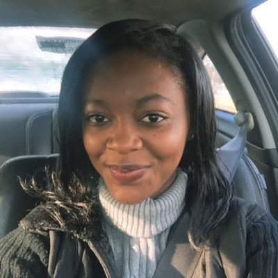
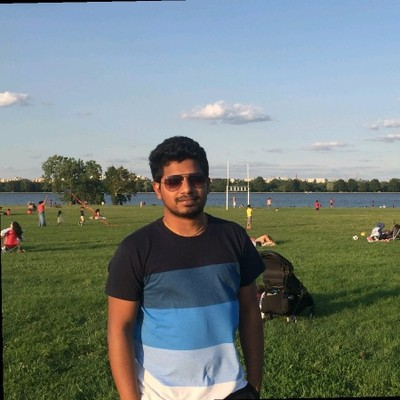
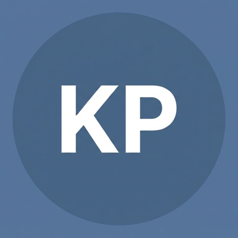
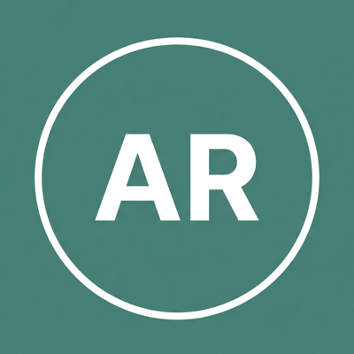

<h1 align="center">GEO Agent Hackathon — Judging Panel</h1>

<em>Meet the experts evaluating your GEO Agent.</em>

---

<table>
<tr>
<td align="center" width="50%">
 
<strong>Subrat Prasad</strong> 
Founding Engineer · <strong>Share.xyz</strong> 
<a href="https://www.linkedin.com/in/humbledshuttler/">LinkedIn</a>
</td>
<td align="center" width="50%">
 
<strong>Sanjay Mishra</strong> 
Principal Software Engineer · <strong>Fidelity Investments</strong> 
<a href="https://www.linkedin.com/in/sanjay-mishra-data-ai/">LinkedIn</a>
</td>
</tr>

<tr>
<td align="center">
 
<strong>Anita B.</strong> 
Business Data Engineer (AI/ML) · <strong>Northside Hospital</strong> 
<a href="https://www.linkedin.com/in/anita-b-592a8b54/">LinkedIn</a>
</td>
<td align="center">
 
<strong>Krishna Reddy</strong> 
Senior Platform Engineer · <strong>HedgeServ</strong> 
<a href="https://www.linkedin.com/in/krishna-reddy-4b11ab133/">LinkedIn</a>
</td>
</tr>

<tr>
<td align="center">
 
<strong>Nihal Kaul</strong> 
Lead Software Engineer · <strong>Revscale AI</strong> 
<a href="https://www.linkedin.com/in/nihalwashere/">LinkedIn</a>
</td>
<td align="center">
 
<strong>Karl Pinto</strong> 
Director – Enterprise Sales, North America East 
<a href="https://www.linkedin.com/in/karlpinto/">LinkedIn</a>
</td>
</tr>

<tr>
<td align="center">
 
<strong>Ankush R.</strong> 
Fellow Mentor · <strong>Adoplist</strong> 
<a href="https://www.linkedin.com/in/ankushrastogi/">LinkedIn</a>
</td>
<td align="center">
 
<strong>Henry Syahputra</strong> 
CTO · <strong>ARC</strong> 
<a href="https://www.linkedin.com/in/henrysyahputra/">LinkedIn</a>
</td>
</tr>
</table>
